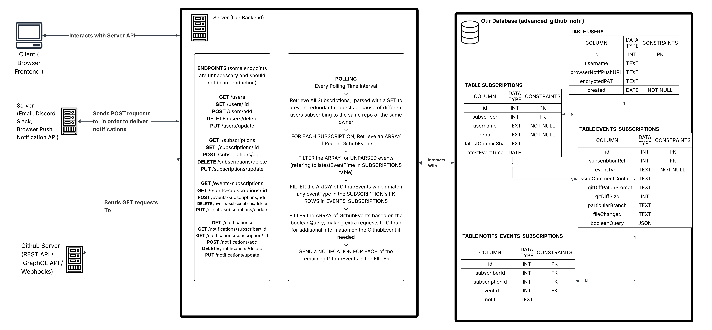
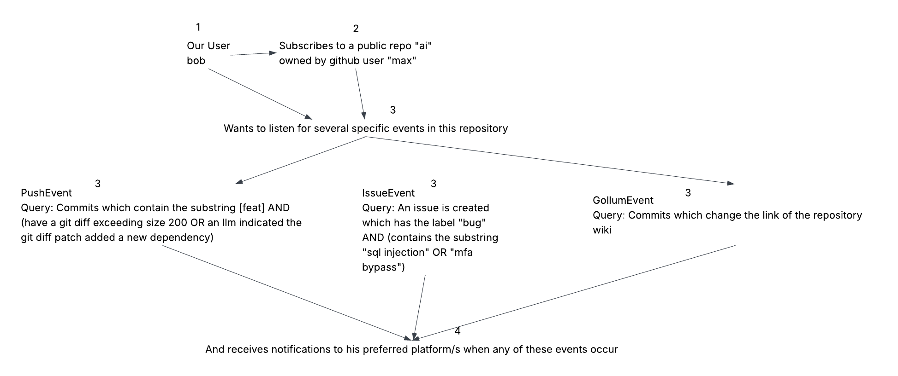

# Advanced Github Notifications
### Get highly customised Github notifications with advanced Boolean Filtering.

### Prereqs
- [Node.js v25.7.0](https://nodejs.org/en/download), [mySQL](https://dev.mysql.com/downloads/installer/)
- clone repo
- run `npm i` in root dir of repo
- configure these environment variables with a .env file in the root dir: `TOKEN, PORT, POLLING_RATE, DB_ENCRYPTION_KEY, MYSQL_HOST, MYSQL_USER, MYSQL_PASS, MYSQL_DB`
    - `TOKEN` refers to Github PAT for Octokit testing/auth, `DB_ENCRYPTION_KEY` should be 32 randomly generated alphanumeric chars (used for symmetric encryption of PAT), `PORT` refers to http port used for server, `POLLING_RATE` refers to how often a notification subscription is checked for new notifications
- run `database/schema.sql` to initialise DB
- run `database/databaseExampleInsertions.sql` to insert some example data into the database
- run `npm run dev` 
- test by making a get request to an endpoint like `http://localhost:8080/users`

### Code Structure
- `database` defines database schema, queries for CRUD, and example data/rows
- `encryption` defines functions which use a 32char key to encrypt/decrypt a string (useful for storing Personal Access Token PAT for Github / other sensitive info  in DB)
- `server` polls github, cruds database, sends notifs to users, as well as request schemas (and inferred types)
- `github-rest-api` defines functions which use octokit and github rest api to get data for subscriptions and events
- `notifications` defines behaviour for sending email/discord/slack/browser notifications

### Notes
- Opted for Github REST API implementation instead of Webhooks to allow usage on repos where the user is not an administrator

### Useful Docs
- [fields in each event response ](https://docs.github.com/en/rest/using-the-rest-api/github-event-types?apiVersion=2022-11-28&search-overlay-input=github+repository+event+response+schema&search-overlay-ask-ai=true)
- [fields in the payload field of each event (shows both common fields and those specific to paritcular events)](https://docs.github.com/en/rest/using-the-rest-api/github-event-types?apiVersion=2022-11-28&search-overlay-input=github+repository+event+response+schema&search-overlay-ask-ai=true#event-object-common-properties)

### Visual Overview
(note: not up to date)
  

### Flow Example

### Misc (useful commands)
- add mysql to path on windows `alias mysql="winpty 'C:/Program Files/MySQL/MySQL Server 8.0/bin/mysql.exe'"`
- connected to mysql `mysql -u root -p`
- run a typescript file, `npx tsx file.ts`
- install custom node version `nvm install 25.7.0` then `nvm use 25.7.0`
- mysql specific queries - show databases; use db_name; describe table_name; describe db_name; 

